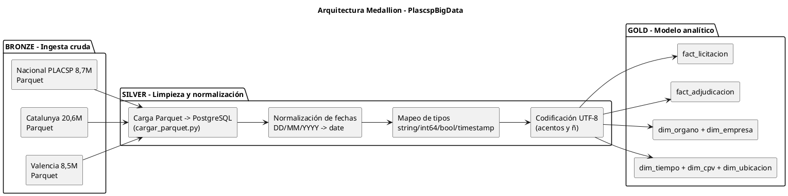
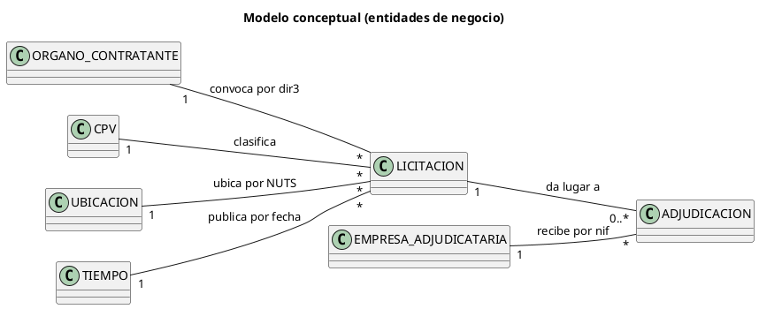
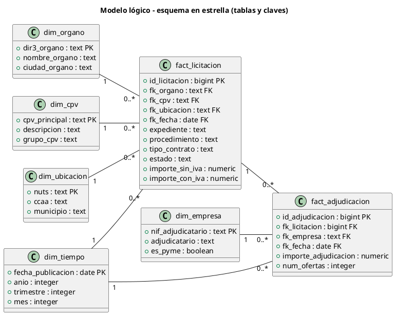

# Plan de Actividades - Entrega semana del 18 al 24 de octubre de 2026

**Proyecto:** PlascspBigData · BD relacional de contratación pública española (PLACSP + Catalunya + Valencia).
**Entrega:** Sábado 24 de octubre de 2026 · 12:00.
**Equipo:** Jose (ETL/Analista técnico) · Kerin (Análisis) · Isabella (QA + Power BI).

> Nota de calendario: en 2026 las fechas 18-24 de octubre caen en domingo(18), lunes(19), martes(20), miércoles(21), jueves(22), viernes(23) y sábado(24). El plan se desarrolla sobre esos 7 días y el cierre del sábado 24 coincide con la fecha de entrega.

---

## 1. Entregables de la semana (5 bloques)

| # | Entregable | Contenido | Responsable principal | Colabora |
|---|---|---|---|---|
| 1 | **Volumetría** | Tabla de tamaño real por tabla en PostgreSQL (filas, tamaño, índices) y comparativa con la estimación Parquet (~1,1 GB → ~21,4 GB en SGBD) | Jose | Kerin |
| 2 | **Modelo lógico-conceptual de la bodega de datos** | Entidades de negocio, relaciones y esquema en estrella (fact + dimensiones) con claves | Kerin | Jose |
| 3 | **Metodología Medallion** | Explicación y aplicación práctica (capas Bronze / Silver / Gold) al pipeline del proyecto | Kerin | Jose |
| 4 | **Explicación de los ETL** | Proceso Parquet → PostgreSQL: mapeo de tipos, normalización de fechas, COPY por lotes e índices | Jose | Kerin |
| 5 | **Fotos de las visualizaciones** | Capturas de pantalla (PNG) del informe Power BI: KPIs, evolución, mapa y fraude | Isabella | - |

Todos los diagramas se documentan **en código PlantUML** dentro de este documento (sección 4).

---

## 2. Roles y responsabilidades

| Miembro | Rol | Requisitos asignados (REQUERIMIENTOS.md) | Entregables de la semana |
|---|---|---|---|
| **Jose** | ETL / Analista técnico | RF-01..RF-06 · RNF-01..RNF-04 | Volumetría + documentación ETL |
| **Kerin** | Análisis (bodega de datos) | RF-07..RF-13 · RNF-05..RNF-07 | Modelo lógico-conceptual + Medallion |
| **Isabella** | QA + Power BI | RF-14..RF-20 · RNF-08..RNF-10 | Vistas Power BI + fotos + validación final |

---

## 3. Calendario de actividades y tiempos (Día 1 → Día 7)

### Día 1 · Domingo 18/10 · Kickoff (equipo, 16:00-18:00 · 2 h)

| Hora | Quién | Actividad | Producto |
|---|---|---|---|
| 16:00-16:30 | Equipo | Revisión conjunta de REQUERIMIENTOS.md y alcance de la entrega | - |
| 16:30-17:00 | Jose | Auditoría del estado de tablas en PostgreSQL (qué está cargado: 26,7M filas) | Listado de tablas OK |
| 17:00-17:30 | Kerin | Repaso de datasets por fuente (Nacional, Catalunya, Valencia) | Mapa de fuentes |
| 17:30-18:00 | Isabella | Definir KPIs y páginas del informe Power BI | Boceto del informe |

### Día 2 · Lunes 19/10 · Trabajo por rol (3 h c/u)

| Hora | Quién | Actividad | Producto |
|---|---|---|---|
| 09:00-12:00 | Jose | **Entregable 1**: medir volumetría real por tabla (`pg_total_relation_size`, `n_live_tup`) | Tabla de volumetría real |
| 10:00-13:00 | Kerin | **Entregable 2**: borrador del modelo conceptual (entidades y relaciones) | Esquema conceptual PlantUML |
| 09:00-12:00 | Isabella | Conexión Power BI → PostgreSQL y primeras consultas del modelo | Data source listo |

### Día 3 · Martes 20/10 · Trabajo por rol (4 h c/u)

| Hora | Quién | Actividad | Producto |
|---|---|---|---|
| 09:00-13:00 | Jose | **Entregable 4**: documentar ETL (mapeo de tipos, fechas, COPY 250K lote, índices) | docs/ETL.md |
| 09:00-13:00 | Kerin | **Entregables 2-3**: modelo lógico (esquema estrella) + esquema Medallion (Bronze/Silver/Gold) | Diagramas PlantUML |
| 09:00-13:00 | Isabella | Dashboard de **KPIs globales** y **evolución temporal** (RF-15, RF-16) | Páginas 1-2 del informe |

### Día 4 · Miércoles 21/10 · Trabajo por rol (4 h c/u)

| Hora | Quién | Actividad | Producto |
|---|---|---|---|
| 09:00-13:00 | Jose | Validar consultas analíticas de negocio (RF-07..RF-13) y vistas reutilizables | Consultas verificadas |
| 09:00-13:00 | Kerin | Redactar explicación de **Medallion aplicado** al proyecto (capas y herramientas) | Sección Medallion del MD |
| 09:00-13:00 | Isabella | **Mapa geográfico** (por NUTS) + **comparativa de fuentes** (RF-17, RF-18) | Páginas 3-4 del informe |

### Día 5 · Jueves 22/10 · Integración y revisión cruzada (4 h)

| Hora | Quién | Actividad | Producto |
|---|---|---|---|
| 09:00-11:00 | Equipo | Integración: reunir volumetría + modelo + Medallion + ETL; revisión cruzada (Pull Request) | PR comentada |
| 09:00-13:00 | Isabella | **Panel de fraude** y **filtros interactivos** (RF-19, RF-20) | Páginas 5-6 del informe |
| 11:00-13:00 | Kerin | Revisar coherencia modelo ↔ vistas ↔ dashboard | Correcciones |

### Día 6 · Viernes 23/10 · Pulido y capturas (4 h)

| Hora | Quién | Actividad | Producto |
|---|---|---|---|
| 09:00-12:00 | Isabella | **Entregable 5**: capturas/fotos de todas las visualizaciones (PNG de alta resolución) | Carpeta `docs/imagenes/` |
| 09:00-12:00 | Jose | Ajustes finales de volumetría y documentación ETL | Docs finales |
| 12:00-13:00 / 15:00-17:00 | Kerin | Ensayo, plantillas de entrega y revisión final del documento | Checklist |

### Día 7 · Sábado 24/10 · ENTREGA (09:00-12:00 + cierre 12:00)

| Hora | Quién | Actividad | Producto |
|---|---|---|---|
| 09:00-10:30 | Equipo | Consolidar todos los documentos y enlazar las imágenes en el MD | PLAN_ENTREGA_OCTUBRE.md final |
| 10:30-11:30 | Equipo | Checklist de la sección 5 y verificación de los 5 entregables | Checklist OK |
| 11:30-12:00 | Equipo | Commit final, subida al repositorio y **ENTREGA** | - |

### Resumen de horas por rol

| Miembro | Dom 18 | Lun 19 | Mar 20 | Mié 21 | Jue 22 | Vie 23 | Sáb 24 | Total |
|---|---|---|---|---|---|---|---|---|
| Jose | 2 | 3 | 4 | 4 | 2 | 3 | 1,5 | **19,5 h** |
| Kerin | 2 | 3 | 4 | 4 | 2 | 3 | 1,5 | **19,5 h** |
| Isabella | 2 | 3 | 4 | 4 | 4 | 3 | 1,5 | **21,5 h** |

### 3.1 Orquestación del sprint (estilo Scrum)

**Sprint Goal:** *"Tener los 5 entregables documentados, verificados con datos reales y subidos al repositorio el sábado 24/10 a las 12:00."*

**Ceremonias:**

| Ceremonia | Día | Hora | Duración |
|---|---|---|---|
| Sprint Planning + Kickoff | Dom 18/10 | 16:00 | 45 min |
| Daily Standup | Lun 19 → Vie 23 | 09:00 | 15 min |
| Backlog refinement (solo si hace falta) | Mié 21/10 | 13:00 | 15 min |
| Sprint Review | Sáb 24/10 | 09:30 | 30 min |
| Sprint Retrospective | Sáb 24/10 | 10:00 | 30 min |
| **Entrega final** | Sáb 24/10 | 12:00 | - |

**Sprint Backlog priorizado** (P0 = imprescindible · P1 = importante · P2 = si el tiempo sobra):

| Prioridad | PBI (Product Backlog Item) | Dueño | Talla | Definición de "done" |
|---|---|---|---|---|
| P0 | Kickoff + Sprint Planning | Equipo | S | Objetivo del sprint entendido por los 3 |
| P0 | Volumetría real por tabla | Jose | M | Tabla con filas, tamaño y % de índices por tabla |
| P0 | Modelo conceptual + lógico de la bodega | Kerin | M | Esquema estrella con claves en PlantUML |
| P0 | Metodología Medallion explicada | Kerin | M | Bronze/Silver/Gold aplicados al pipeline |
| P0 | Explicación de los ETL | Jose | M | Parquet → PostgreSQL con tipos, fechas y lotes |
| P0 | Fotos de las visualizaciones | Isabella | M | 6 capturas PNG en `docs/imagenes/` |
| P0 | Revisión cruzada + entrega (PR) | Equipo | S | Los 3 aprueban y el repo queda actualizado |
| P1 | Panel de fraude + filtros interactivos | Isabella | M | Páginas 5-6 del informe Power BI |
| P1 | Vistas analíticas (RF-07..13) | Jose | M | Consultas < 5 s sobre datos indexados |
| P1 | Coherencia modelo ↔ dashboard | Kerin | S | Los nombres fact/dim coinciden en consultas |
| P2 | Ensayo de presentación (demo 10 min) | Kerin | S | Demo fluida de pies a cabeza |

---

## 4. Diagramas (PlantUML)

Los diagramas están escritos en código PlantUML para poder regenerarse o editarse en cualquier renderizador (`plantuml.com/plantuml`, VS Code Plugin, etc.).

### 4.1 Diagrama de Gantt del sprint (Scrum)

```plantuml
@startgantt
title Sprint ENTREGA 18-24 oct 2026 · Scrum · PlascspBigData
Project starts 2026-10-18

' ================= CEREMONIAS (Equipo) =================
[Sprint Planning + Kickoff (45 min)] as [C1] lasts 1 day
[C1] starts 2026-10-18
[C1] #FFF59D

[Daily Standup 19/10 (15 min)] as [C2] lasts 1 hour
[C2] starts 2026-10-19
[C2] #FFF59D

[Daily Standup 20/10 (15 min)] as [C3] lasts 1 hour
[C3] starts 2026-10-20
[C3] #FFF59D

[Daily Standup 21/10 (15 min)] as [C4] lasts 1 hour
[C4] starts 2026-10-21
[C4] #FFF59D

[Daily Standup 22/10 (15 min)] as [C5] lasts 1 hour
[C5] starts 2026-10-22
[C5] #FFF59D

[Daily Standup 23/10 (15 min)] as [C6] lasts 1 hour
[C6] starts 2026-10-23
[C6] #FFF59D

[Sprint Review 24/10 (30 min)] as [RV] lasts 1 hour
[RV] starts 2026-10-24
[RV] #FFF59D

[Sprint Retrospective 24/10 (30 min)] as [RT] lasts 1 hour
[RT] starts 2026-10-24
[RT] #FFF59D

' ================= PBI JOSE (ETL / Análisis técnico) =================
[Auditoría BD y datasets] as [J1] lasts 1 day
[J1] starts 2026-10-18
[J1] #AADDF7

[Volumetría real por tabla] as [J2] lasts 1 day
[J2] starts 2026-10-19
[J2] #AADDF7

[Documentación ETL] as [J3] lasts 1 day
[J3] starts 2026-10-20
[J3] #AADDF7

[Validación analítica + vistas (RF-07..13)] as [J4] lasts 1 day
[J4] starts 2026-10-21
[J4] #AADDF7

[Ajustes finales volumetría/ETL] as [J5] lasts 1 day
[J5] starts 2026-10-23
[J5] #AADDF7

' ================= PBI KERIN (Análisis / bodega de datos) =================
[Modelo conceptual de la bodega] as [K1] lasts 1 day
[K1] starts 2026-10-19
[K1] #C8E6C9

[Modelo lógico + esquema Medallion] as [K2] lasts 1 day
[K2] starts 2026-10-20
[K2] #C8E6C9

[Explicación Medallion aplicada] as [K3] lasts 1 day
[K3] starts 2026-10-21
[K3] #C8E6C9

[Revisión coherencia modelo-vistas] as [K4] lasts 1 day
[K4] starts 2026-10-22
[K4] #C8E6C9

[Ensayo y revisión de docs] as [K5] lasts 1 day
[K5] starts 2026-10-23
[K5] #C8E6C9

' ================= PBI ISABELLA (QA + Power BI) =================
[Definición de KPIs e informe] as [I1] lasts 1 day
[I1] starts 2026-10-18
[I1] #F8BBD0

[Conexión Power BI -> PostgreSQL] as [I2] lasts 1 day
[I2] starts 2026-10-19
[I2] #F8BBD0

[Dashboard KPIs y evolución temporal] as [I3] lasts 1 day
[I3] starts 2026-10-20
[I3] #F8BBD0

[Mapa geográfico + comparativa de fuentes] as [I4] lasts 1 day
[I4] starts 2026-10-21
[I4] #F8BBD0

[Panel de fraude + filtros interactivos] as [I5] lasts 1 day
[I5] starts 2026-10-22
[I5] #F8BBD0

[Capturas de visualizaciones (PNG)] as [I6] lasts 1 day
[I6] starts 2026-10-23
[I6] #F8BBD0

' ================= PBI EQUIPO (integración) =================
[Integración + revisión cruzada (PR)] as [E1] lasts 1 day
[E1] starts 2026-10-22
[E1] #E0E0E0

[Consolidación de docs + Entrega] as [E2] lasts 1 day
[E2] starts 2026-10-24
[E2] #E0E0E0

' ================= HITOS =================
[Sprint Backlog definido] happens 2026-10-18
[Documentos integrados (PR) · volumetría OK] happens 2026-10-22
[Capturas y ensayo OK] happens 2026-10-23
[ENTREGA FINAL · 12:00] happens 2026-10-24
@endgantt
```

**Leyenda de colores:** amarillo = ceremonias Scrum (equipo) · azul = Jose (ETL) · verde = Kerin (Análisis/bodega) · rosa = Isabella (QA + Power BI) · gris = integración y entrega (equipo).

### 4.2 Metodología Medallion aplicada al proyecto



**Explicación:** Bronze = datos crudos tal cual llegan de las 3 fuentes (Parquet). Silver = datos cargados, normalizados y con tipos correctos en PostgreSQL (ETL). Gold = capa de negocio con el esquema en estrella (fact/dim) que consume Power BI.

### 4.3 Modelo conceptual de la bodega de datos



### 4.4 Modelo lógico de la bodega (esquema en estrella)



---

## 5. Checklist final de la entrega (Sábado 24/10)

- [ ] **Volumetría**: tabla con filas, tamaño y % de índices por tabla (real vs estimado).
- [ ] **Modelo**: diagramas conceptual y lógico (esquema estrella) incluidos en el MD.
- [ ] **Medallion**: explicación de Bronze/Silver/Gold con su aplicación concreta al proyecto.
- [ ] **ETL**: descripción del pipeline Parquet → PostgreSQL (tipos, fechas, lotes, índices).
- [ ] **Visualizaciones**: capturas PNG de las 6 páginas del informe en `docs/imagenes/`.
- [ ] Revisión cruzada de los 3 miembros (PR comentada en el repositorio).
- [ ] Commit final y entrega el sábado 24/10 a las 12:00.