# Modelo Entidad-Relación - PlascspBigData

Modelo de datos de la base relacional de contratación pública española (PLACSP Nacional + Catalunya + Valencia).

> Diagrama generado en PlantUML. Renders: <https://www.plantuml.com/plantuml> o plugin de VS Code.
> Volumetría: 37,8M registros (2000-2026) · 7 tablas cargadas (~26,7M filas) · PostgreSQL 18.

## 1. Resumen del modelo

El modelo se divide en dos capas (arquitectura Medallion):

- **Capa Silver (tablas cargadas):** tablas normalizadas por fuente con `COPY` directo desde Parquet (`licitaciones`, `subvenciones_raisc`, `contratos_registro`, ...).
- **Capa Gold (modelo analítico):** dimensiones (`organo`, `empresa`, `cpv`, `ubicacion`, `tiempo`) que Fact (licitaciones y adjudicaciones estandarizadas) que consumen las vistas analíticas y Power BI.

Relaciones de negocio clave: `dir3_organo` (órgano), `nif_adjudicatario` (empresa), `cpv_principal` y `nut4/nuts` (ubicación).

## 2. Diagrama ER completo (PlantUML)

```plantuml
@startuml
title ENTIDAD-RELACIÓN · PlascspBigData · contratación pública España
!theme plain

' ============ CAPA GOLD · dimensiones ============
entity "DIM_ORGANO" as org {
  * pk_dir3_organo : text <<PK>>
  --
  nombre_organo : text
  nif_organo : text
  ciudad_organo : text
}

entity "DIM_EMPRESA" as emp {
  * pk_nif_adjudicatario : text <<PK>>
  --
  adjudicatario : text
  es_pyme : boolean
}

entity "DIM_CPV" as cpv {
  * pk_cpv_principal : text <<PK>>
  --
  descripcion : text
  grupo_cpv : text
}

entity "DIM_UBICACION" as ub {
  * pk_nuts : text <<PK>>
  --
  ccaa : text
  municipio : text
}

entity "DIM_TIEMPO" as t {
  * pk_fecha : date <<PK>>
  --
  anio : integer
  trimestre : integer
  mes : integer
}

' ============ CAPA GOLD · hechos ============
entity "FACT_LICITACION" as fact_lic {
  * id_licitacion : bigint <<PK>>
  --
  fk_dir3_organo : text <<FK>>
  fk_cpv_principal : text <<FK>>
  fk_nuts : text <<FK>>
  fk_fecha_publicacion : date <<FK>>
  expediente : text
  objeto : text
  procedimiento : text
  tipo_contrato : text
  estado : text
  importe_sin_iva : numeric
  importe_con_iva : numeric
}

entity "FACT_ADJUDICACION" as fact_adj {
  * id_adjudicacion : bigint <<PK>>
  --
  fk_id_licitacion : bigint <<FK>>
  fk_nif_adjudicatario : text <<FK>>
  fk_fecha_adjudicacion : date <<FK>>
  importe_adjudicacion : numeric
  num_ofertas : integer
}

' ============ CAPA SILVER · tablas cargadas ============
entity "licitaciones (PLACSP Nacional)" as t_lic {
  id : bigint
  expediente : text
  organo_contratante : text
  nif_organo : text
  dir3_organo : text
  adjudicatario : text
  nif_adjudicatario : text
  tipo_contrato : text
  procedimiento : text
  estado : text
  importe_sin_iva : numeric
  importe_con_iva : numeric
  importe_adjudicacion : numeric
  num_ofertas : integer
  cpv_principal : text
  ubicacion : text
  nuts : text
  fecha_publicacion : date
  fecha_adjudicacion : date
}

entity "subvenciones_raisc (Catalunya)" as t_raisc {
  * id_subv : bigint <<PK>>
  --
  beneficiario_nif : text
  beneficiario_nombre : text
  organ : text
  importe_subvencio : numeric
  "Data concessió" : date
}

entity "contratos_registro (Catalunya)" as t_reg {
  * id_contracte : bigint <<PK>>
  --
  organ_contractant : text
  direccio_nom : text
  adjudicatari_nif : text
  adjudicatari_nom : text
  import_adjudicacio : numeric
  "Data formalització" : date
}

entity "contractacio_menors (Catalunya)" as t_men {
  * id : bigint <<PK>>
  --
  organ_contractant : text
  adjudicatari_nif : text
  adjudicatari_nom : text
  pressupost_licitacio : numeric
  pressupost_adjudicacio : numeric
  fase : text
}

entity "publicaciones_pscp (Catalunya)" as t_pub {
  * id : bigint <<PK>>
  --
  organ : text
  nif_licitador : text
  import : numeric
  data_publicacio : date
}

entity "adjudicaciones_generalitat (Catalunya)" as t_adjgen {
  * id : bigint <<PK>>
  --
  organ : text
  nif_empresa : text
  empresa_nom : text
  import : numeric
  data : date
}

entity "valencia_contratacion (Valencia)" as t_val {
  * id : bigint <<PK>>
  --
  organ : text
  nif_contractista : text
  contractista : text
  import : numeric
  data : date
}

' ============ RELACIONES GOLD ============
org ||--o{ fact_lic : "convoca (dir3)"
cpv ||--o{ fact_lic : "clasifica"
ub ||--o{ fact_lic : "ubica (nuts)"
t ||--o{ fact_lic : "publica"
fact_lic ||--o{ fact_adj : "da lugar a"
emp ||--o{ fact_adj : "recibe (nif)"

' ============ RELACIONES SILVER -> DIMENSIONES ============
org ||--o{ t_lic : "referencia dir3_organo"
emp ||--o{ t_lic : "referencia nif_adjudicatario"
org ||--o{ t_raisc : "referencia organis"
emp ||--o{ t_raisc : "beneficiario_nif"
org ||--o{ t_reg : "organ_contractant"
emp ||--o{ t_reg : "adjudicatari_nif"
org ||--o{ t_men : "organ_contractant"
emp ||--o{ t_men : "adjudicatari_nif"
org ||--o{ t_pub : "organ"
emp ||--o{ t_pub : "nif_licitador"
org ||--o{ t_adjgen : "organ"
emp ||--o{ t_adjgen : "nif_empresa"
org ||--o{ t_val : "organ"
emp ||--o{ t_val : "nif_contractista"
@enduml
```

## 3. Explicación del modelo

| Relación | Sentido | Clave |
|---|---|---|
| DIM_ORGANO → LICITACION / tablas Silver | 1 a N | `dir3_organo` / `organ_contractant` / `organ` |
| DIM_EMPRESA → ADJUDICACION / tablas Silver | 1 a N | `nif_adjudicatario` / `adjudicatari_nif` / `nif_contractista` |
| LICITACION → ADJUDICACION | 1 a N | `id_licitacion` / `expediente` |
| DIM_CPV → LICITACION | 1 a N | `cpv_principal` |
| DIM_UBICACION → LICITACION | 1 a N | `nuts` / `ubicacion` |
| DIM_TIEMPO → LICITACION / ADJUDICACION | 1 a N | `fecha_publicacion` / `fecha_adjudicacion` |

**Nota sobre los NIF/órganos:** las tablas Silver conservan el esquema original de cada fuente (nombres de columna en español/catalán). La capa Gold normaliza nombres y sirve de puente único para Power BI y las vistas analíticas.